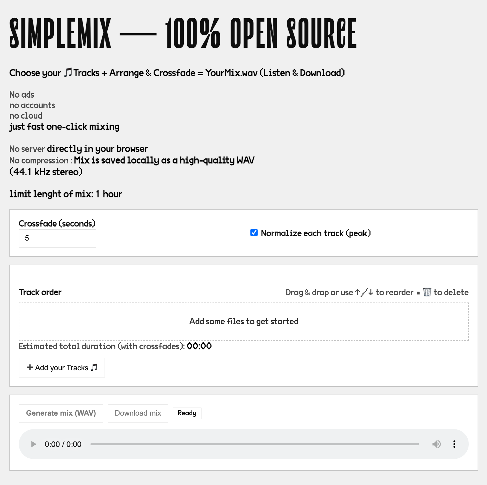

# 🎶 SimpleMix

Just load your tracks, order them, crossfade, and download.  
No ads, no accounts, no cloud. **100% local, minimal, free.**

**SimpleMix** was created to answer a simple demand:  
most audio tools are **too complex** and overloaded with features.  

Instead, **SimpleMix** focuses on the essentials:
- Load your tracks
- Reorder them (drag & drop or buttons)
- Visualize the **crossfades** clearly
- Export a clean, local mix (WAV)

> **SimpleMix — Fade it. Don’t overcomplicate it.**

---

## ✅ Features
- 100% local: everything runs in your browser, nothing is uploaded.
- Add multiple audio files (MP3/WAV/OGG/FLAC, depending on browser support).
- Reorder tracks easily (drag & drop).
- Apply a customizable crossfade (in seconds).
- Normalize each track (peak normalization).
- Preview in-browser and export to **WAV**.
- Hard limit: **1 hour maximum** mix length (to avoid browser crashes).

---

## 🖼️ Preview image
You can display a static preview image above the audio player.

Example included in this repo:  
`img/preview.jpeg`

In `index.html`:

⚠️ **This project is only a prototype / test version.**  
It was built as a **front-end only demo** (HTML + CSS + JS, using the Web Audio API) to explore the idea of building audio mixes directly in the browser.

## Limitations
- Hard limit: **1h max** (to avoid browser crashes).
- Runs in the browser’s memory → not suited for very long or heavy mixes.
- No persistence (files disappear when you refresh).

## Why?
This is a **proof-of-concept** before developing a **real full-stack version** with:
- file uploads,
- server-side rendering (FFmpeg/SoX),
- authentication,
- storage,
- job queue (Messenger).

## Next steps (full version idea)
A real full-stack version would include:
- Symfony API (PHP)
- FFmpeg backend processing (safe, open-source)
- Job queue (Symfony Messenger)
- Authentication (JWT or session)
- File storage (local → S3 later)
- User dashboards

## Disclaimer
This project is for **educational and experimental purposes only**.
The user is fully responsible for ensuring they have the rights to any audio files uploaded.

## 📜 License
This project is licensed under **Creative Commons BY-NC 4.0**.  
You are free to use, modify, and share it for personal and educational purposes.  
**Commercial use is strictly prohibited.**

For details, see [LICENSE.md](LICENSE.md).